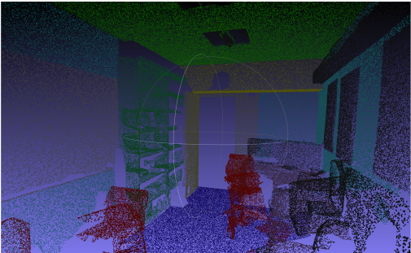
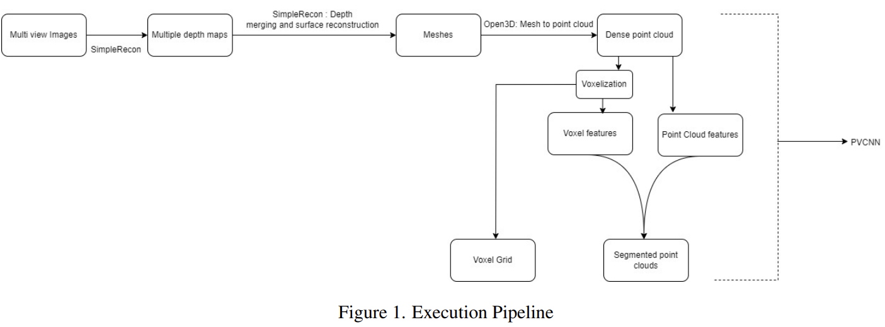
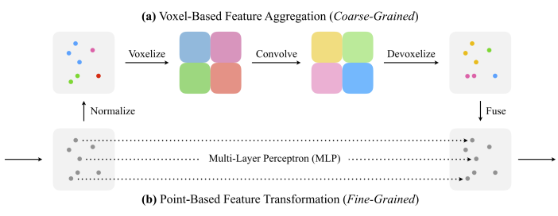
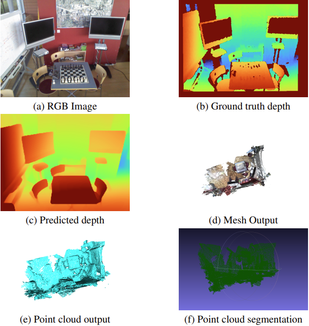

# 3D Indoor Mapping and Object Segmentation

## Project Overview
Indoor navigation for robots has become crucial, enabling autonomous robots to navigate complex environments. This project introduces a novel approach using RGB images for indoor mapping and object segmentation. The method involves creating a 3D mesh from Multi-View Stereo (MVS) RGB images, converting it into a point cloud for environmental segmentation. We conducted experiments to establish a baseline, presenting findings, and suggesting future improvements.

## Table of Contents
1. [Introduction](#1-introduction)
   - [Motivation](#11-motivation)
   - [Contributions](#12-contributions)
2. [Related Work](#2-related-work)
   - [Indoor Scene Mapping](#21-indoor-scene-mapping)
   - [Scene Schematic Segmentation](#22-scene-schematic-segmentation)
   - [Point Cloud Segmentation](#23-point-cloud-segmentation)
3. [Method](#3-method)
   - [Depth Maps (SimpleRecon)](#31-depth-maps-simplerecon)
   - [3-D Reconstruction](#32-3-d-reconstruction)
   - [Obtaining Point Cloud](#33-obtaining-point-cloud)
   - [Point Cloud Segmentation (Point-Voxel CNN)](#34-point-cloud-segmentation-point-voxel-cnn)
4. [Experiments and Results](#4-experiments-and-results)
   - [SimpleRecon](#41-simplerecon)
   - [Point Segmentation Comparison](#42-point-segmentation-comparison)
   - [Results](#43-results)
5. [Analysis of Prior Pipeline](#5-analysis-of-prior-pipeline)
6. [Conclusion](#6-conclusion)
7. [Credits](#8-credits)

## Project Contributors
- Rishikesh Jadhav, University of Maryland, rjadhav1@umd.edu
- Nishant Pandey, University of Maryland, npandey2@umd.edu
- Jayasuriya Suresh, University of Maryland, jsuriya@umd.edu

# 1. Introduction
Indoor mapping is essential for robot navigation in diverse environments. In this paper, we propose a method utilizing RGB images for 3D mapping and object segmentation, contributing to various applications such as robotics, emergency scenarios, and virtual reality. Our approach combines SimpleRecon and Point-Voxel CNN for efficient and accurate scene reconstructions.

   - **1.1 Motivation**
     - Utilizing RGB images for mapping offers advantages in cost, field of view, and information gathering speed. Our method aims to provide quick point cloud segmentation using RGB images, essential for real-time applications.

   - **1.2 Contributions**
     - Proposing a novel method for indoor mapping using RGB images.
     - Conducting experiments to demonstrate the viability of the pipeline.
     - Analyzing and discussing results, providing avenues for future work.

# 2. Related Work
Recent works in indoor mapping leverage various technologies, such as voxel-based representations, point clouds, and RGBD input. Our research aims to achieve similar outcomes using RGB images exclusively, allowing for efficient processing and storage without significant loss of detail.

   - **2.1 Indoor Scene Mapping**
     - Various works use different techniques, such as voxel-based representations, point clouds, and RGBD cameras, for indoor scene mapping. Our approach builds upon these methods, focusing on RGB images for efficient processing.

   - **2.2 Scene Schematic Segmentation**
     - Scene mapping and segmentation closely relate. Our proposed method integrates segmentation into the mapping pipeline using RGB images.

   - **2.3 Point Cloud Segmentation**
     - Several neural network-based point cloud segmentation models, including Point-Voxel CNN, have been proposed. We leverage Point-Voxel CNN for our segmentation tasks.

# 3. Method

Our approach combines SimpleRecon and Point-Voxel CNN for indoor mapping and object segmentation. The pipeline involves obtaining depth maps, 3D reconstruction, converting mesh data to point clouds, and point cloud segmentation.

   - **3.1 Depth Maps (SimpleRecon)**
     - SimpleRecon enhances 3D scene reconstruction using a 2D CNN with a cost volume for depth prediction. The integration of metadata ensures accurate depth predictions, making it suitable for real-time, low-memory environments.

   - **3.2 3-D Reconstruction**
     - We use Infinitam for depth merging and surface reconstruction. This step is crucial for translating depth information into a usable 3D format.

   - **3.3 Obtaining Point Cloud**
     - Converting mesh data to a point cloud using Open3D involves extracting vertices and creating a point cloud. This step ensures efficient representation of the scene.

   - **3.4 Point Cloud Segmentation (Point-Voxel CNN)**
     - Point-Voxel CNN aggregates high-level point cloud features and low-level voxel features. The voxel-based feature aggregation and point cloud feature extraction contribute to accurate segmentation.

# 4. Experiments and Results
We conducted experiments on the Microsoft research RGB-D Dataset 7-Scenes using pre-trained model weights for SimpleRecon. The proposed pipeline was tested for segmentation accuracy using Point-Voxel CNN on S3DIS.

   - **4.1 SimpleRecon**
     - We tested SimpleRecon with different configurations, considering keyframes and metadata. The recommended combination involves using metadata for depth predictions.
      

   - **4.2 Point Segmentation Comparison**
     - Various Pointnet-based segmentation models were compared, with Point-Voxel CNN++ showing slightly better accuracy.
       

   - **4.3 Results**
     - The results indicate optimal performance up to the point of passing the generated dense point cloud to the Point-Voxel CNN for segmentation. The lack of ground truth data and hardware limitations impacted the evaluation.
       

# 5. Analysis of Prior Pipeline
An initial framework attempting to extract point clouds from a single RGB image was unsuccessful. The sparse point cloud generated from this approach was not suitable for segmentation so we solved it by using Multi view Stereo to get a dense point cloud.

# 6. Conclusion
While the proposed method demonstrated viability, there is room for improvement. Future work should explore advanced mapping techniques, camera pose estimation from video sequences, and cross-data set training for segmentation models.

# 8. Credits
We appreciate the authors of SimpleRecon and Point-Voxel CNN for open-sourcing their code. Special thanks to Stanford, Microsoft, and Scannet for providing valuable datasets, and to the project's professor and teaching assistants for guidance.
